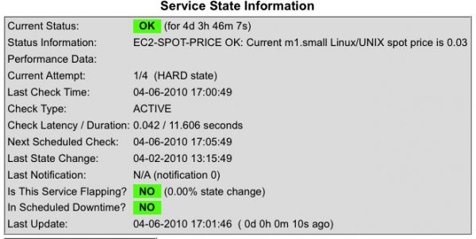

nagios-ec2-spot-price-plugin
============================

Checks the current spot price for a given Amazon EC2 instance type and generates an alert if the price is greater than the specified limits.

Written in Python; requires the Amazon EC2 command line tools.

